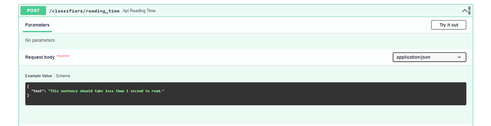
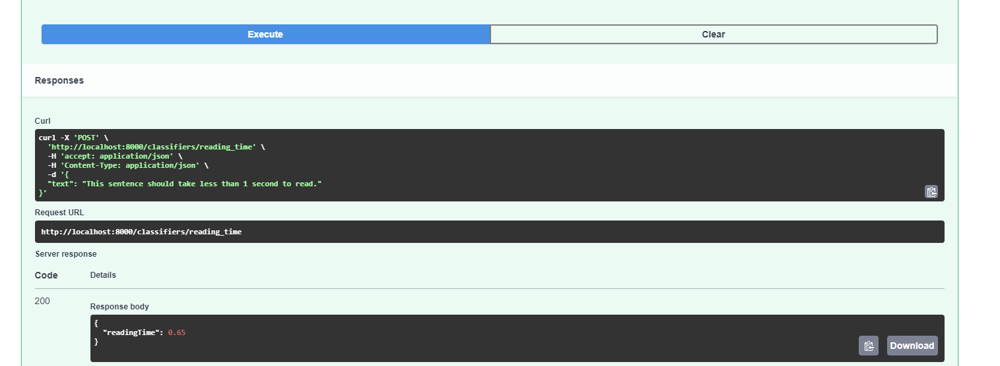

# Welcome to the contributions guideline for bricks
Please refer to this document if you want to add your own modules/heuristics to the library.

## Note: 
Before diving deep into how the components of this repository work, there are some points of notice:
- For implementing new modules, we have to follow a standardized structure which can consist of fine details. However, there is nothing to worry about since all the necessary steps to implement new modules are explained below.
- Every little contribution counts - We are aware that not all the users checking `bricks` out would be proficient in python or any programming language for that matter. This shouldn't discourage anyone from contributing their ideas. For example, just opening a new issue consisting of some new idea is considered a valid contribution. The implementation will then be taken care of by us.

## Table of contents
1. [Structure of this repository](#structure-of-this-repository)
    1. [Module types](#module-types-classifiers-extractors-and-generators)
    2. [Bricks groups](#brick-groups)
    3. [Structure of brick modules](#structure-of-brick-modules-__init__py-readmemd-code_snippet_refinerymd-code_snippet_commonmd-and-configpy)
2. [How to contribute ideas](#how-to-contribute-ideas)
3. [How to contribute modules](#how-to-contribute-modules)
    1. [SpaCy in extractors](#spacy-in-extractors)
    2. [Configuring the config.py file](#configuring-the-configpy-file)
    3. [Desired output of a brick](#desired-output-of-a-brick)
4. [Test your module](#test-your-module)
    1. [Finding errors](#finding-errors)
5. [Quality assurance](#quality-assurance)
6. [What happens next?](#what-happens-next)


## Structure of this repository

### Module types: `classifiers`, `extractors`, and `generators`
We have structured this repository into two main folders:
- `classifiers`: this is where the modules will go into that are used to classify a given text into a specific category. For example, a module that classifies a text into the category `news` or `blog` would go into this folder. It can also be about enrichments, e.g. to detect languages and such.
- `extractors`: this is where the modules will go into that are used to extract information from a given text. For example, a module that extracts the author of a text would go into this folder.
- `generators`: this is where the modules will go that are used to produce values based on the provided text. For example, a module that corrects spelling mistakes while take an incorrect text and generate the corrected text.

### Brick groups:
Since bricks 2.0, brick modules will be grouped together with similar modules. For example, there may be one brick called `sentiment brick`, which then contains different algorithms to classify a text by the sentiment (like VADER, GPT, etc.). The user is then able to choose the desired algorithm. 

A group may consist of as little as one implementation. There is no limit to how many implementations a group can contain. 

### Structure of brick modules: `__init__.py`, `README.md`, `code_snippet_refinery.md`, `code_snippet_common.md` and `config.py`
Each module has a folder with the following structure:
- `__init__.py`: if the module can be executed as a script, this file contains the entry point.
- `README.md`: a description of the module, which is displayed on the platform on the detail page of the module.
- `code_snippet_refinery.md`: the displayed code snippet based on a SpaCy input. This is showed on the detail page of the module.
- `code_snippet_common.md`: the displayed code snippet for any Python env on the detail page of the module.  This is showed on the detail page of the module.
- `config.py`: a config script to synchronize this repository with the online platform.

## How to contribute ideas
If you have an idea for a new module/heuristic, please [open an issue](https://github.com/code-kern-ai/bricks/issues) in this repository. We will discuss the idea and if it is a good fit for the library, we will add it to the library. This means you don't _have to_ write the code yourself and can still contribute to the library. If you want to write the code yourself, please refer to the next section.

## How to contribute modules
1. As stated above, please first add the idea as an issue. We'll use this to document the origin of the module, and will use it to help you during the contribution.
2. Create a new branch with the name of the module you want to add. Please do **not** add multiple modules in one branch.
3. Duplicate the `_template` directory of the type of module you want to add (e.g. `extractors/_template`) and rename the directory to the name of your module.
4. Start by changing the `config.py` file by updating the issueId to the issue you created in step 1.
5. Implement the `__init__.py` file. This is the entry point of the module, and will be executed when the module is run. If you are not sure about the expected output of the function, please read [the output section](#desired-ouput).
6. Add your function to the top-level `__init__.py` of your module type, so either in `extractors/__init.py__`, `classifiers/__init.py__`, or `generators/__init.py__`. If the brick module if part of a new brick group, create a new folder for the group and import the brick from there. 
7. [Test](#test-your-module) your module.
8. Modify `code_snippet_refinery.md`, and keep in mind that this must fit the interface of refinery. If you copied from the `_template` directory, you will already see the expected interface. All the variables holding the user defined inputs shall be defined as constants (all capital letters). If you are not sure about the expected output of the function, please read [the output section](#desired-ouput). Optionally, you can also add a file `code_snippet_common.md`, which contains code that can be executed in any Python environment. 
9. Document and describe your function in the `README.md` file. This will be displayed on the detail page of the module, which means you can go more into detail with your description. Make sure the module description in `README.md` tails the description from the docstring you wrote in `__init__.py`.
10. Finally, make your last changes to the `config.py` by updating the name of the function you implemented in this module. Add other [parameters of the `config.py`](#configuring-the-configpy-file).
11. Create a pull request to the `main` branch of the repository. Add a comment `implements #<your-issue-id>` to the pull request, so that we can link the pull request to the issue.

If you have any questions along the way, please don't hesitate to reach out to us, either in the issue you created, or via [Discord](https://discord.gg/qf4rGCEphW).

### spaCy in `extractors`
We use spaCy for extractor modules, as it helps to put texts into correct tokens. Please use spaCy for extractor modules, and match character returns with token-level returns. For instance, in the `__init__.py` file:
```python
def date_extraction(request: DateExtraction):
    text = request.text
    
    # load the spaCy module as a singleton
    nlp = SpacySingleton.get_nlp(request.spacyTokenizer)
    doc = nlp(text)

    # process e.g. via a regular expression
    regex = re.compile(r"(?:[0-9]{1,2}|Jan(?:uary)?|Feb(?:ruary)?|Mar(?:ch)?|Apr(?:il)?|May|Jun(?:e)?|Jul(?:y)?|Aug(?:ust)?|Sep(?:tember)?|Oct(?:ober)?|Nov(?:ember)?|Dec(?:ember)?)[\/\. -]{1}(?:[0-9]{1,2}|Jan(?:uary)?|Feb(?:ruary)?|Mar(?:ch)?|Apr(?:il)?|May|Jun(?:e)?|Jul(?:y)?|Aug(?:ust)?|Sep(?:tember)?|Oct(?:ober)?|Nov(?:ember)?|Dec(?:ember)?)[,\/\. -]{1}(?:[0-9]{2,4})")

    # match the found character indices to spaCy
    spans = []
    for match in regex.finditer(text):
        start, end = match.span()
        span = doc.char_span(start, end)
        spans.append([span.start, span.end, span.text])

    return {"spans": spans}
```

Note that spaCy doesn't have to be used in the `code_snippet.md` file, as this is only used for the code snippet in the library. refinery uses spaCy under the hood, such that all records are already tokenized.

### Configuring the `config.py` file:
This file syncs the brick with an online CMS. This is done via a configuration file to avoid the need to do this manually. 

If you struggle with this file: Don't worry! You can leave a blank dictionary for now. A member of our team will gladly help you to set it up afterward. 

The upper half of the config contains most of the general information of the brick. 
- `input_example`: A dictionary called `INPUT_EXAMPLE` should be set in the `__init__.py` and imported into the `config.py`. 
- `issue_id`: Is the corresponding GitHub issue number of the brick module. If no issue was created for a brick, you can do so [here](https://github.com/code-kern-ai/bricks/issues). 
- `tabler_icon`: Refers to the icon that should be displayed for this brick. An icon can be chosen [here](https://tabler-icons-react.vercel.app/). 
- `min_refinery_version`: If the brick requires a Python package, it might only be available after the dev-team has added this package to the execution environment to refinery. The `min_refinery_version` refers to the first version in which the needed library was added to refinery. 
- `state`: The `state` parameter simply refers to if this bricks should be publicly visible yet. Set this to `DRAFT` if you think this needs some more work. 
- `gdpr_compliant`:If this module uses an API that sends data to outside to the EU, the brick automatically is not `gdpr_compliant` anymore, which then needs to the set to `"False"` then. 
- `type`: If the brick uses a paid API, it is also then a `premium` function. Otherwise it's a `python_function`. 
- `kern_token_proxy_usable`: In the future, Kern AI will offer a Kern API token, with which different services can be used. Once this is the case, the `kern_token_proxy_usable` will be set to `"True"`. Otherwise is is set to `"False".` 
- `docker_image`: We plan to offer certain bricks as a `docker_image` in the future. The name of the image will then be entered here.
- `available_for`: The `available_for` containing `"refinery"` if the `"code_snippet_refinery.md"` exists and/or `"commom"` to  `"code_snippet_common.md"` exists. The first containing code that expects a SpaCy dictionary as an input, the latter containing code which can directly be executed in any Python environment without the need for SpaCy.
- `part_of_group`: Every brick is also part of at least two groups: the parent directory, i.e. `"sentiment"`, `"spelling"` etc, and `"gdpr_compliant"` or `"gdpr_uncompliant"`. This is set at `part_of_group`.


```python
def get_config():
    return build_generator_function_config(
        function=levenshtein_distance,
        input_example=INPUT_EXAMPLE,
        data_type="text",
        issue_id=22,
        tabler_icon="SquareRoundedLetterL",
        min_refinery_version="1.7.0",
        state=State.PUBLIC.value,
        gdpr_compliant="True",
        type="python_function",
        kern_token_proxy_usable="False",
        docker_image="None",
        available_for=["refinery", "common"],
        part_of_group=["distance", "gdpr_compliant"],
```
 
At the bottom of the config, you will find the section "integratior inputs". This section is mean for the bricks integrator, which allows the integration of bricks into our main tool Kern AI refinery. The integrator should always have at least the following structure:
```python
        integrator_inputs={
            "name": "levenshtein_distance",
            "refineryDataType": "text",
            "outputs": ["yes", "no"],
            "constants": {
                "inputAttribute": { # previously YOUR_ATTRIBUTE, never optional
                    "selectionType": "string",
                    "defaultValue": "your-text",
                },
            },
        }
)
```
The name refers to the name of the module. refineryDataType is the type of input to be set in refinery, this can be category, text, integer, float or boolean for attribute calculation. For bricks that should be used as labeling functions, this should be set to text. Outputs is a list containing possible outputs. This list does not server as a rule of which outputs are allowed, but rather provides some default values which might be changed later on. The constants affect anything that should be set in the code_snippet_refinery.md. Everything configurable here can then be set via the bricks integrator, which paste the constants into the code which will be used in refinery. 

We use that structure to a) standardize module implementations, making it easier to maintain the underlying code of modules, and b) to synchronize the repository with the online platform. This means that if you add a new module to the repository, it will be added to the platform via a script that reads the `config.py` file.

### Desired output of a brick
The output that is expected by the actual endpoint in bricks (your `__init__.py`) and the source code for refinery (your `code_snippet.md`) differ a bit. This section should provide a guideline on how the output of the modules should look like.

**Classifiers:**
The output that is returned in the function in `__init__.py` will be displayed on bricks and should look similar to this:
```python
...
return {"name-of-classifiation-task": classification_result}
```

The output that is returned in the function of the source code in `code_snippet.md` should be usable in refinery and should look like this:
```python
...
return classification_result
```


**Extractors:**
The extractors should return the span at the position of the text in which the desired part of the text can be found.

The output that is returned in the function in `__init__.py` will be displayed on bricks and should look similar to this:
```python
...
return {"labels": ["label-name-here", span.start, span.end]}
```

The output of the function in `code_snippet.md` should be usable in refinery. To label individual tokens, please use `yield` instead of `return`. Similar to this:
```python
...
yield "label-name-here", span.start, span.end
```


**Generators:**
The output that is returned in the generator function in `__init__.py` will be displayed on bricks and should look similar to this:
```python
...
return {"output": output}
```

The output that is returned in the function of the source code in `code_snippet.md` should be usable in refinery and should look like this:
```python
...
return output
```

## Test your module
Testing the correct functioning can be done by using FastAPI, which let's you interact with an interface to test out the module as an actual endpoint on your local machine. To start FastAPI, type:
```
uvicorn api:api --reload
```
This will start up FastAPI and automatically reload the API once you saved any changes made to your code.

Please note that you have to have your function registered at the top-level `__init__.py` of your module type. Otherwise it will not show up in the FastAPI web interface.

After starting FastAPI, head over to `http://localhost:8000/docs` where you can access all of the created modules. Search for the module that you have created and click on it. On the right side, you will see a button stating `try it out`. 



If you correctly filled in the `__init__.py` file of your module, the example request body should already contain an example text you specified as the `EXAMPLE_INPUT` in the `__init__.py`. Click on execute, and the response will contain a response code as well as a response body. If everything works well, the response code will be `200`. 



### Finding errors
If you get different response codes, your module probably needs some rework. There are many possible errors that can occur. [Here is a list of all response codes](https://en.wikipedia.org/wiki/List_of_HTTP_status_codes). 

## Quality assurance
We want to make sure that things work nicely and that the modules are of high quality. Therefore, when reviewing your submission, we'll do blackbox tests and check for the above criteria. Again, this is about collaboration, so please don't worry about this too much. We'll help you with this!

## What happens next?
We have a content management system up and running, in which we enter newly registered endpoints. As soon as your endpoint is merged into the `main` branch, we'll add it to the CMS. This triggers a task for our dev rel team, so it usually doesn't take too long. You can then find it on our [online platform](https://bricks.kern.ai/) :)
