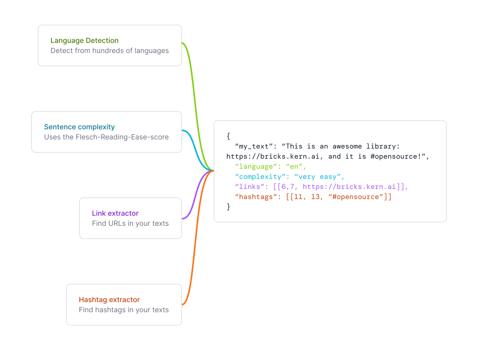
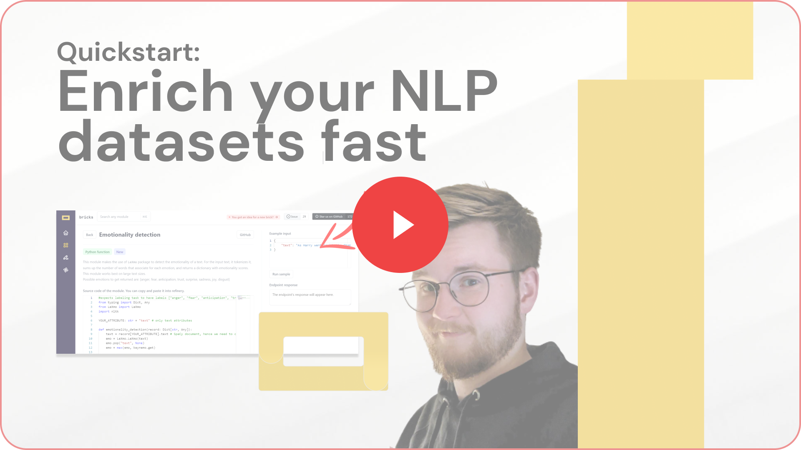

    <b>Open-source natural language enrichments at your fingertips.</b>

    
    
    
    
    
    
    
    
    

Browse [bricks](https://bricks.kern.ai) to find gold nuggets for your projects; enrich your texts e.g. with sentence complexity estimations, sentiment analysis, and more.

## Table of contents
- [Why bricks?](#why-bricks)
- [Demo](#demo)
- [What are classifiers and extractors?](#what-are-classifiers-and-extractors)
- [Structure of modules](#structure-of-modules)
- [Getting started](#getting-started)
- [Contributing](#contributing)
- [refinery](#refinery)
- [Regular updates and newsletter](#regular-updates-and-newsletter)
- [License](#license)

## Why bricks?
We're aiming to build a library of off-the-shelf natural language enrichments that can be used in any project as well as directly in our main project [refinery](https://github.com/code-kern-ai/refinery). We're building `bricks` to make it easier for developers to build better products. That's where the name comes from. `bricks` is a library not in the sense that you `pip install` it in your repository, but that you can copy-paste the code from the online platform. 

## Demo

Click on the image or [here](https://www.youtube.com/watch?v=Wcbdwwr5AI8&ab_channel=KernAI) to watch the demo.

## What are classifiers, extractors and generators?
We generally summarize them as modules in this repository.
- `classifiers` are modules that summarize a given text into a specific category. For example, a module that classifies a text into the category `news` or `blog` would go into this folder. It can also be about enrichments, e.g. to detect languages and such.
- `extractors` are modules that retrieve specific information from a given text. For example, a module that extracts the author of a text would go into this folder.
- `generators` create new content based on a given text, or filtersets for refinery with pre-defined content. For example, a module that translates one language into another language would be a generator.

## Structure of modules
Each module has a folder with the following structure:
- `__init__.py`: if the module can be executed as a script, this file contains the entry point.
- `README.md`: a description of the module, which is displayed on the platform on the detail page of the module.
- `code_snippet.md`: the displayed code snippet on the detail page of the module. This is exactly how you can run the code in [refinery](#refinery).
- `config.py`: a config script to synchronize this repository with the online platform.

If you want to add a new module, please look into our [contributing guidelines](#contributing).

## Getting started
You can access the modules of this repository in [bricks](https://bricks.kern.ai). If you want to host the modules yourself, you can do so by following the steps below.

1. Clone this repository
2. (optional) Create a virtual environment
3. Install the dependencies (`pip install -r requirements.txt`)
4. Run the FastAPI server (`uvicorn api:api`)
5. Go to `http://localhost:8000/docs` to see the documentation

## Contributing
Modules added in this repository are added to the online platform by us continuously. If you want to add your own module, please follow the [contribution guidelines](CONTRIBUTING.md). If you have any questions, please reach out to us anytime on [Discord](https://discord.gg/qf4rGCEphW).

If the content of this repository is helpful, please leave a star ⭐️. Also, make sure to check out [refinery](#refinery).

## refinery
Check out our main product [refinery](https://github.com/code-kern-ai/refinery), which is another open-source project helping you to scale, assess and maintain your training data. You can use the modules from bricks right away in refinery.

## Regular updates and newsletter
We regularly update bricks with new modules (we aim to add two modules per week, if not more). If you want to stay up to date, you can subscribe to our [newsletter](https://www.kern.ai/#email-address).

## License
This repository is licensed under the Apache License, Version 2.0. View a copy of the [License file](LICENSE).
